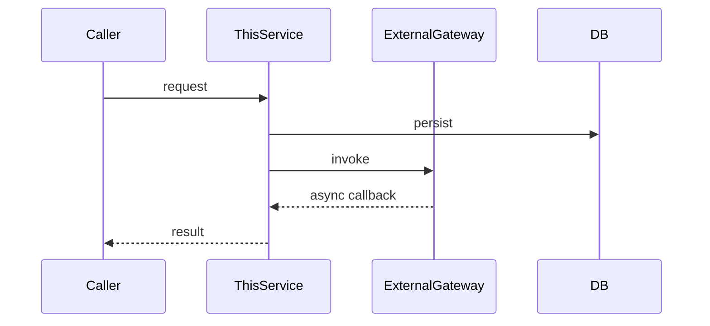

# <Capability Name>

> One-sentence business intent (what users / callers can do).
> Trigger scenario: [who invokes this and when].

**Status**: live
**Owning service**: `<service-name>` · `<core-package>`
**Database tables touched**: `<table1>`, `<table2>`

> Status values: `live` (implemented and shipping), `planned` (designed but not yet implemented — promote in place when implementation lands), `deprecated` (kept for traceability while callers migrate; remove once unreferenced).

> **One file = one Business Capability Unit (BCU).** A BCU is a piece of business value that can be developed, tested, and delivered independently, where modifying it primarily affects this single business chain. Do NOT split by microservice / Controller / API / technical module / database table; DO split by real business chain / actual development task boundary / parallel-development unit. See SKILL.md "BCU Splitting Principle" for the decision flow.

## Business Goal

- Goal: <business goal — what value this BCU delivers>
- Applicable platform / scenario: <consumer side / merchant side / batch job / etc.>

## Implementation

List **every** technical artifact this BCU uses. A BCU often spans multiple layers — keep them together so the end-to-end picture is in one place. Only list sub-bullets that actually exist; delete the ones that do not apply.

- HTTP API: `[METHOD] [path]` — [purpose] (`[controller class#method]`)
- RPC: `[ClassName.methodName(params)]` — [purpose / callers]
- MQ Production: `[topic]` — [message content]; consumers: `[consumer BCU slugs]`
- MQ Consumption: `[topic]` — [what happens after consuming]; producer: `[producer BCU slug]`
- Scheduled Task: `[task-name]` cron `[expression]` — [what it does]
- Third-party Callback: `[provider]` `[event]` → `[handler class#method]` — [what the callback signals]
- Database tables touched: `[table]` (insert / update / delete)
- Frontend page: `[path]` (`[app-name]`) — calls `[API list]`
- State management: `[storeName.action]` — [responsibility]

<!-- Omit this entire section if the BCU has no real chain to describe (trivial single-step BCUs whose Implementation already covers the flow — e.g. a liveness probe). Do not keep an empty heading and do not restate Implementation as a one-liner. -->

## Flow

End-to-end execution path of this BCU — including every service / resource / external system this BCU traverses. The flow is bounded to THIS BCU's chain; do not draw the system's global service topology here (that belongs in `docs/architecture.md`).

Format selection (apply the section-omission rule — never draw a diagram for its own sake):

- **Simple** (≤3 steps, single service, no async branches) → ASCII / numbered text:

```
[trigger] → [step 1] → [step 2 with branch] → [outcome]
```

- **Cross-service / multi-actor / async / multi-roundtrip** → Mermaid `sequenceDiagram` with one participant per service / external system / resource the BCU actually touches:



<!-- Boundary: this diagram captures THIS BCU's call chain only — services / resources / externals it actually invokes. Do NOT include unrelated services, and do NOT draw the global service topology. Global topology lives in docs/architecture.md. -->

<!-- Omit the entire section below if the BCU has no state machine. -->

## State Transitions

- `[EnumName.STATE_A]` → `[STATE_B]` / `[STATE_C]`
- Trigger: [what causes the transition]

<!-- Omit the entire section below if the BCU has no upstream/downstream relationships to record. -->

## Upstream / Downstream

- Upstream (this BCU calls): `[bcu-slug]`, `[rpc target]`, `[mq topic consumed]`
- Downstream (depends on this BCU): `[caller bcu-slug]`, `[mq consumer bcu-slug]`

<!-- Omit the entire section below if the BCU has no third-party / external system integration. -->

## External Dependencies

- `[3rd-party system / SaaS / gateway]` — purpose + integration mode (HTTP / SDK / webhook)

<!-- Omit the entire section below if the BCU is not part of a multi-BCU business chain. -->

## Related Business Flows

- `[bcu-slug]` — together with this BCU forms `[business chain name]`

<!-- Omit the entire section below if no BCU-specific risks/constraints apply. -->

## Risks / Constraints

- [risk or constraint that future modifications must respect]

<!-- Omit the entire section below if no module-wide gotchas apply. -->

## Notes / Gotchas

- [gotcha or TODO]
