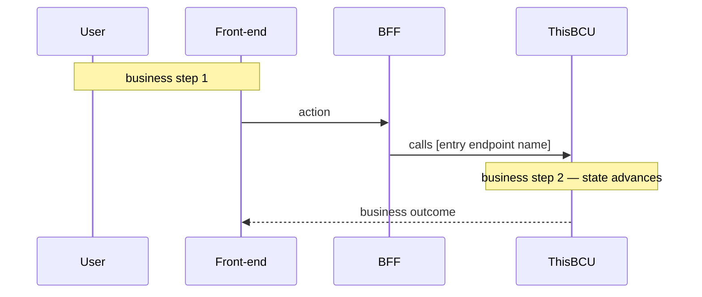

# <Capability Name>

> One-sentence business intent (what users / callers can do).
> Trigger scenario: [who invokes this and when].

**Status**: live
**Owning service**: `<service-name>` · `<core-package>`
**Database tables touched**: `<table1>`, `<table2>`

> Status values: `live` (implemented and shipping), `planned` (designed but not yet implemented — promote in place when implementation lands), `deprecated` (kept for traceability while callers migrate; remove once unreferenced).

> **One file = one Business Capability Unit (BCU).** A BCU is a piece of business value that can be developed, tested, and delivered independently, where modifying it primarily affects this single business chain. Do NOT split by microservice / Controller / API / technical module / database table; DO split by real business chain / actual development task boundary / parallel-development unit. See SKILL.md "BCU Splitting Principle" for the decision flow.

## Business Goal

- Goal: <business goal — what value this BCU delivers>
- Applicable platform / scenario: <consumer side / merchant side / batch job / etc.>

## Implementation

List **every** technical artifact this BCU uses. A BCU often spans multiple layers — keep them together so the end-to-end picture is in one place. Only list sub-bullets that actually exist; delete the ones that do not apply.

> **Per-entry tracing diagrams**: each *entry-point* bullet — HTTP API (inbound), MQ Consumption, Scheduled Task, Third-party Callback — MAY carry its own tracing diagram of this entry's full call chain (services / RPC / MQ Production / external systems / resources / DB).
>
> **Format — primary: ASCII span tree, supplementary: Mermaid `sequenceDiagram`**:
> - **Primary (default)** — ASCII **span tree** of the factual call chain, mirroring the way SkyWalking / distributed-tracing UIs render a trace: hierarchical indentation showing parent → child calls. Compact, diff-friendly, human-readable in plain text.
> - **Supplementary (optional)** — when the entry is async / multi-roundtrip / has callbacks that the tree shape can't naturally express, add a Mermaid `sequenceDiagram` AS A SECOND diagram for global overview. Don't replace the tree — add alongside it.
> - **Trivial entries** — omit both. Single read-and-return / single SQL insert needs no diagram.
>
> **Two rules apply together**:
> 1. **Optional** — skip diagrams when the entry is trivial.
> 2. **Complete when present** — if a tree (or sequence) diagram is drawn, it MUST cover every real hop end-to-end. Half-drawn / partial-chain diagrams are forbidden.
>
> **Do NOT** attach diagrams to non-entry items: outbound RPC calls, MQ Production, Database tables, Frontend page, State management. These appear as nodes inside entry diagrams; a separate diagram would be redundant.

- HTTP API: `[METHOD] [path]` — [purpose] (`[controller class#method]`)

  ```
  [METHOD] [path]
  ├── [Service.method] (this service)
  │   ├── DB.[table] insert/update/delete
  │   └── [DownstreamService].[method] (RPC) → [result]
  ├── [ExternalGateway].[op] (HTTP/SDK) → [result]
  └── MQ produce [topic]
  ```

- MQ Consumption: `[topic]` — [what happens after consuming]; producer: `[producer BCU slug]`

  ```
  consume [topic]
  ├── [Handler.method]
  │   ├── DB.[table] update
  │   └── [Downstream].[method] (RPC) → [result]
  └── (ack)
  ```

- Scheduled Task: `[task-name]` cron `[expression]` — [what it does]

  ```
  cron [task-name]
  ├── DB.[table] scan PENDING > [threshold]
  ├── for each row:
  │   ├── [ExternalGateway].query → [actual state]
  │   └── DB.[table] update [state]
  └── (done)
  ```

- Third-party Callback: `[provider]` `[event]` → `[handler class#method]`

  ```
  [provider].[event] → [handler]
  ├── verify signature
  ├── [Service].onCallback
  │   ├── DB.[table] update
  │   └── MQ produce [topic]
  └── return ACK
  ```

  <!-- For complex async / multi-roundtrip callbacks, ADD a Mermaid sequenceDiagram BELOW the tree as a global overview — do not replace the tree. -->

- RPC: `[ClassName.methodName(params)]` — [purpose / callers]
  <!-- No separate diagram — appears as a node in the calling entry's tree. -->

- MQ Production: `[topic]` — [message content]; consumers: `[consumer BCU slugs]`
  <!-- No separate diagram — appears as a node in the producing entry's tree. -->

- Database tables touched: `[table]` (insert / update / delete)
- Frontend page: `[path]` (`[app-name]`) — calls `[API list]`
- State management: `[storeName.action]` — [responsibility]

<!-- Omit this entire section if the BCU has no business-level flow worth describing beyond what ## Implementation already shows (e.g. a single-entry trivial BCU). Do not keep an empty heading and do not restate Implementation as a one-liner. -->

## Flow

Business-level flow(s) of the BCU — how front-end interactions / business steps / state transitions weave through the entry points listed in `## Implementation`. This is the **business view**: what business step happens, which interface gets called to achieve what, what the user sees / what state advances.

A BCU may have **0, 1, or N** business flows here:
- **0** — omit the section entirely (single-entry trivial BCUs).
- **1** — write one diagram (or numbered text) directly under `## Flow`.
- **N** — when the BCU contains multiple distinct business sub-flows (e.g. passive-scan vs aggregated-scan vs refund), use `### <Sub-flow name>` headings, one diagram per sub-flow. Do not force mutually exclusive branches into a single bloated diagram.

Use ASCII / numbered text or Mermaid `sequenceDiagram` / `flowchart` per sub-flow — choose what reads clearly.

> **Non-redundancy with `## Implementation` tracing diagrams**:
> - These diagrams' nodes are **business steps / user actions / state transitions**, NOT service hops.
> - When the business flow invokes an entry, just **reference its name** (e.g. "calls `POST /pay/passive-scan`"); do NOT redraw the entry's internal call chain — that lives in the entry's own tracing diagram under `## Implementation`.

Single-flow example:



Multi-flow shape (use `### <Sub-flow>` headings — one diagram each).

<!-- Omit the entire section below if the BCU has no state machine. -->

## State Transitions

- `[EnumName.STATE_A]` → `[STATE_B]` / `[STATE_C]`
- Trigger: [what causes the transition]

<!-- Omit the entire section below if the BCU has no upstream/downstream relationships to record. -->

## Upstream / Downstream

- Upstream (this BCU calls): `[bcu-slug]`, `[rpc target]`, `[mq topic consumed]`
- Downstream (depends on this BCU): `[caller bcu-slug]`, `[mq consumer bcu-slug]`

<!-- Omit the entire section below if the BCU has no third-party / external system integration. -->

## External Dependencies

- `[3rd-party system / SaaS / gateway]` — purpose + integration mode (HTTP / SDK / webhook)

<!-- Omit the entire section below if the BCU is not part of a multi-BCU business chain. -->

## Related Business Flows

- `[bcu-slug]` — together with this BCU forms `[business chain name]`

<!-- Omit the entire section below if no BCU-specific risks/constraints apply. -->

## Risks / Constraints

- [risk or constraint that future modifications must respect]

<!-- Omit the entire section below if no module-wide gotchas apply. -->

## Notes / Gotchas

- [gotcha or TODO]
